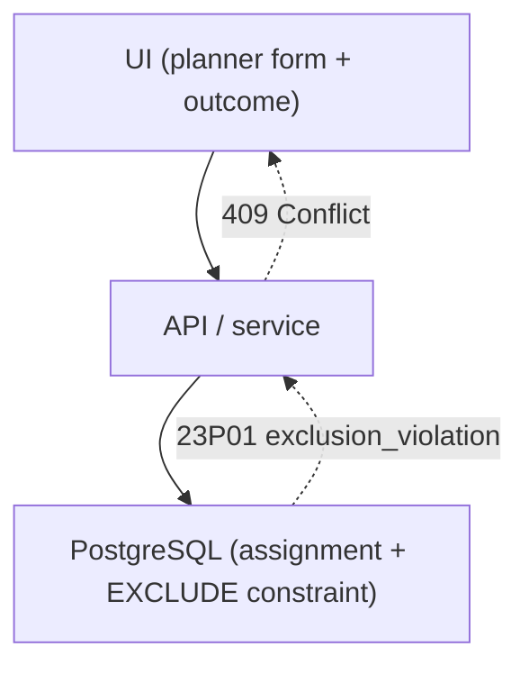
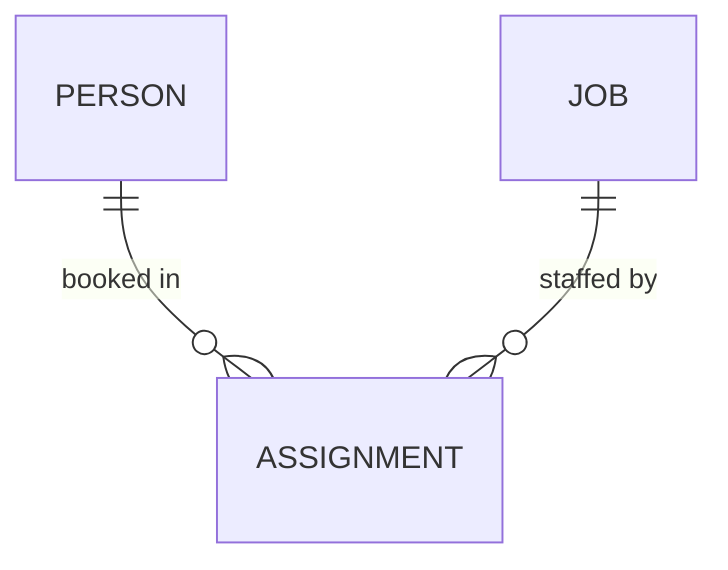
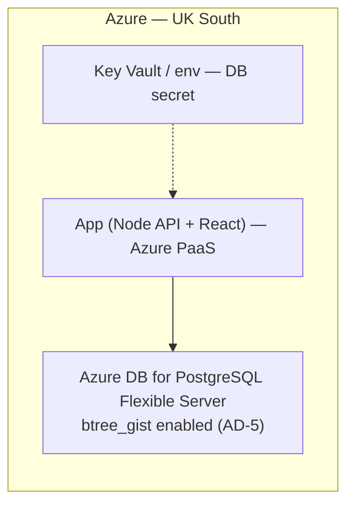

# Architecture Spine — Double-Booking Guard

## Design Paradigm

Plain **layered**: `UI → API/service → data`. No ports/adapters or domain core — the app is a throwaway spike and the constitution forbids speculative abstraction.

The load-bearing thing is not the layering (a reviewer reads that off the tree) but **where the clash rule is allowed to live**: only at the data layer. See AD-1 and AD-2.



Dependency direction is one-way (`UI → API → DB`); the only thing that flows back up is the rejection signal (`23P01 → 409 → message`). No layer above the data layer may make a clash decision.

## Invariants & Rules

### AD-1 — Non-overlap is a database constraint, not application logic [ADOPTED]

- **Binds:** FR3, FR4, FR5
- **Prevents:** a read-then-check interleave window; two overlapping bookings for one person ever persisting.
- **Rule:** clash prevention is enforced by a Postgres exclusion constraint on `assignment`:
  `EXCLUDE USING gist (person_id WITH =, daterange(start_date, end_date, '[]') WITH &&)` (requires `btree_gist`). The losing concurrent write fails at commit with `SQLSTATE 23P01`. No code path — service, UI, or job — may implement its own overlap check.

### AD-2 — The service translates the violation; it does not detect clashes [ADOPTED]

- **Binds:** all
- **Prevents:** a "helpful" clash check leaking into the service or UI, creating a second (drifting, race-prone) source of truth for the rule; and a rejection turning into a `500` because the service queried the *aborted* transaction to enrich its response.
- **Rule:** the service's only role in the guard is to catch `23P01` and map it to the loser contract (AD-3, AD-6). It performs no `SELECT`-then-decide. On `23P01` the transaction is rolled back and the response body is built **from the request payload + the caught error only** — never a follow-up query inside the failed transaction (which raises `25P02`). The clash definition exists in exactly one place: the constraint (AD-4).

### AD-3 — The loser gets a deterministic rejection at two layers [ADOPTED]

- **Binds:** FR5
- **Prevents:** the losing planner seeing a `500`, a timeout, or a silent no-op; and tests coupling to message wording.
- **Rule:** **API** returns **HTTP 409 Conflict** with the AD-6 body. **UI** shows a plain-language message bound to a **stable `data-testid` hook**, copy finalized in build. A clash — and every other rejected input (AD-4 range validity, unknown ids) — is returned as a `4xx`, never surfaced as a system error.

### AD-4 — The date range is the single source of the clash rule [ADOPTED]

- **Binds:** FR1, FR3
- **Prevents:** a second, drifting encoding of "what counts as a clash"; and a timezone coercion silently shifting a boundary day (UJ-1 is August, BST = UTC+1) — which would flip the exact "7 Aug touches 7–10 Aug" case AC3 exists to nail.
- **Rule:** an assignment's dates are stored as an **inclusive** range at **day** granularity: bare `YYYY-MM-DD` values in `date` columns, expressed as `daterange(start_date, end_date, '[]')`. **No `timestamp`/`timestamptz` type touches an assignment date anywhere in the pipeline.** FR3's rule — *any shared day, endpoints included* (so 3–7 Aug clashes with 7–10 Aug) — is captured **only** by the `&&` overlap in AD-1's constraint, nowhere else. Range validity (`end ≥ start`; `start == end` is a valid single-day booking) is enforced by the API as a `4xx` precondition (AD-3), not left to a raw DB error.

### AD-5 — The extension is a version-controlled step, not environment tribal knowledge [ADOPTED]

- **Binds:** FR4, deployment
- **Prevents:** the guarantee being un-createable in a fresh environment because `btree_gist` was enabled by hand and never recorded.
- **Rule:** enabling `btree_gist` is part of the tracked schema: `azure.extensions` must list it (Azure server parameter) **and** a migration runs `CREATE EXTENSION IF NOT EXISTS btree_gist`. On Azure Flexible Server, `CREATE EXTENSION` is rejected unless the allow-list parameter is set first — both steps live in version control.

### AD-6 — The 409 body is a fixed contract shared by API and UI [ADOPTED]

- **Binds:** FR5, AC1, AC3, AC4
- **Prevents:** the API and UI stories both satisfying AD-3 yet failing to wire together — the API shipping `{personId, dates}` while the UI needs a human name for *"Sam's already booked"*, so AC4 stays green while AC1/AC3 break.
- **Rule:** the 409 body is a fixed JSON shape:
  `{ "code": "DOUBLE_BOOKING", "personId": <uuid>, "personName": <string>, "start": "YYYY-MM-DD", "end": "YYYY-MM-DD" }`.
  The UI renders `personName`; tests assert on `code`, not prose.

### AD-7 — The P0 race is pinned deterministically, not left to UI timing [ADOPTED]

- **Binds:** FR4, AC1
- **Prevents:** an accidentally-serialized "concurrent" test (single shared connection, or a commit landing before the second read) passing while only the *sequential* guard (already AC3) was ever exercised — the P0 going green without proving the guarantee.
- **Rule:** each `create` is exactly **one transaction**. AC1's exactly-one-wins is proven by **two genuinely concurrent committed transactions** at the service/DB level; the Playwright two-context UI test complements it end-to-end but does **not** substitute for the deterministic pin.

## Consistency Conventions

| Concern | Convention |
| --- | --- |
| Entities | `Person`, `Job`, `Assignment` (per PRD glossary); `Person`/`Job` pre-seeded, not managed here; `person_id`/`job_id` are `NOT NULL` FKs. |
| Identifiers | `uuid` primary keys. |
| Dates | Bare `YYYY-MM-DD`, day granularity, inclusive range; persisted via `daterange(..,'[]')` in `date` columns; no timezone-bearing type (AD-4). |
| Error shape | Clash → `409` with the AD-6 body; input/range errors and unknown ids → `400`/`404`; no path returns a `500` for an expected rejection (AD-3). |
| Input validation | The API validates before the write: `end ≥ start`, ids resolve, fields present — the other half of the constitution's sanitise-input rule. |
| Tests | Authored from the AC, **red before implementation, never weakened to go green** (ATDD, inherited). Acceptance tests key on a stable `data-testid`, never message copy; a service/DB-level test pins AC1 (race, AD-7) and AC4 (409) deterministically. |
| Test isolation | Acceptance/P0 runs use a fresh, isolated database — never shared mutable state — so "exactly one wins" is repeatable. |
| Migrations | Version-controlled SQL (incl. the constraint + extension); the constraint **is** the spec for FR3 (spec-as-contract — behaviour change and its migration/story land in the same PR). Migration tool deferred. |
| Config & secrets | One `DATABASE_URL`-style env var, from env locally/CI and Azure Key Vault when deployed; never in code or git. |
| Delivery discipline (inherited) | One small, single-reviewer PR (counter-pressure: AI large diffs — keep slices small deliberately); PR carries the AC→test table, the spec in-diff with author + timestamp, and the two-way `AB#` link. Governed by the constitution + PRD §7, not re-decided here. |

## Stack

| Name | Version | Status |
| --- | --- | --- |
| PostgreSQL (Azure Database for PostgreSQL Flexible Server, UK South) | 17 (16/17/18 all supported on Azure) | Load-bearing — AD-1 depends on it |
| `btree_gist` extension | bundled with the PG version | Load-bearing — enables the EXCLUDE constraint |
| Playwright | current | Confirmed (constitution) — ATDD source of truth |
| Node (API service) | LTS, confirm at scaffold | Indicative — deferrable |
| React (UI) | confirm at scaffold | Indicative — deferrable |

The JS front/back versions stay indicative per the constitution and are pulled into existence by the first story (PRD-first, not scaffold-first). Only the datastore, its extension, and the test runner are pinned, because the guarantee (AD-1) and the ATDD rule depend on them.

## Structural Seed

```text
(single-app spike; layered)
  ui/          # React planner form: create assignment, show success / clash message
  api/         # Node service: routes + 23P01→409 mapping (no clash logic — AD-2)
  db/
    migrations/  # schema + CREATE EXTENSION btree_gist + the EXCLUDE constraint (AD-1, AD-5)
  tests/
    e2e/         # Playwright: AC1 (two contexts, concurrent), AC2, AC3
    api/         # AC4 — direct-to-API 409
```

Core entities (names + relationships only; the clash attribute is an invariant, so it lives in AD-4, not here):



Deployment envelope (Azure UK):



## Capability → Architecture Map

| Requirement | Lives in | Governed by |
| --- | --- | --- |
| FR1 — create assignment (UI) | `ui/`, `api/` | layered paradigm, AD-4 |
| FR2 — non-clashing succeeds | `api/`, `db/` | AD-1 (constraint admits it) |
| FR3 — clash rejected (inclusive overlap) | `db/migrations/` | AD-1, AD-4 |
| FR4 — concurrency atomic, exactly-one-wins | `db/migrations/`, `api/` | AD-1, AD-7 |
| FR5 — deterministic loser contract (409 + UI msg) | `api/`, `ui/` | AD-2, AD-3, AD-6 |
| AC1 (race, two contexts) · AC2/AC3 (UI) · AC4 (API 409) | `tests/e2e/`, `tests/api/` | AD-7, test + test-isolation conventions |

## Deferred

- **App host** (Azure Container Apps vs App Service) — a single-app spike; the choice creates no cross-unit divergence. Lean: Container Apps. Revisit when the first story scaffolds hosting.
- **JS stack versions** (Node/React) — indicative; fixed by the first story's scaffold, not here.
- **UI message copy & surfacing** (inline vs toast/banner; form clears vs preserves dates) — story-level; AD-3 fixes only the stable-hook + plain-language contract.
- **Everything out of PRD scope** — skills-matching, availability calendars, auth/roles, person/job management, UI polish. Not this spine.
