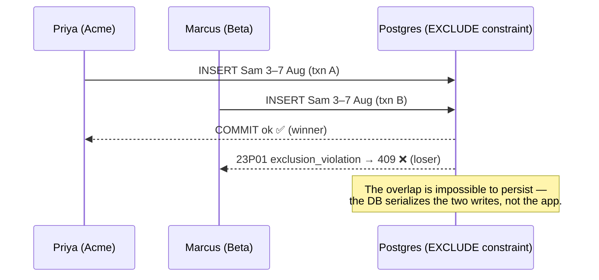

# Why the double-booking guarantee holds

*A reviewer's guide for the Double-Booking Guard PR. Companion to `ARCHITECTURE-SPINE.md`.*

The spike's whole thesis is that **AI-authored code is safe because a named human can review and own it**. So the guarantee is built to be *legible*, not just correct: the thing you have to trust is small enough to read in one sitting. This page is that reading.

## The guarantee, in one line

> Two planners booking the same person for overlapping dates at the same instant → **exactly one booking persists**, the other gets a deterministic `409`. A person is never double-booked, even on a shared boundary day.

## Where the correctness lives — one constraint, not a code path

The entire guard is this, in a version-controlled migration:

```sql
CREATE EXTENSION IF NOT EXISTS btree_gist;   -- also allow-listed via azure.extensions (AD-5)

ALTER TABLE assignment ADD CONSTRAINT no_double_booking
  EXCLUDE USING gist (
    person_id                                WITH =,   -- same person …
    daterange(start_date, end_date, '[]')    WITH &&    -- … overlapping days
  );
```

Read it as: *no two rows may share a `person_id` **and** an overlapping day-range.* The database refuses to store the overlap. There is **no application code that checks for clashes** — so there is no read-then-check window to interleave, which is exactly the bug the P0 test hunts.

When two writes race, the loser's `INSERT` fails at commit with `SQLSTATE 23P01` (`exclusion_violation`). The service's only job is to translate that into the `409`.



## The four traps this design already closes

These are the ways a plausible implementation *looks* right but silently isn't. Each is pinned by an architecture decision, so a reviewer can check for the failure rather than re-derive it:

| Trap | What goes wrong | Pinned by |
| --- | --- | --- |
| **`[)` instead of `[]`** | Postgres' *default* half-open range would let 3–7 Aug and 7–10 Aug **not** clash — the shared last day slips through. The `'[]'` is load-bearing. | AD-4 |
| **Timezone coercion** | Parsing `"2026-08-03"` through a `Date`/`timestamptz` (August is BST = UTC+1) can shift a boundary by a day and flip the exact case AC3 exists to nail. Dates stay bare `YYYY-MM-DD` in `date` columns. | AD-4 |
| **A `500` on the loser** | Enriching the `409` body with a `SELECT` inside the *aborted* transaction raises `25P02` → the loser sees a crash, not a clean rejection. The body is built from the request payload + caught error only. | AD-2, AD-3 |
| **A falsely-green P0** | A "concurrent" test that accidentally serializes (shared connection, or a commit landing first) passes while only the *sequential* guard was exercised — the race never ran. The race is pinned by two genuinely concurrent committed transactions. | AD-7 |

## What to check in the PR (where the risk is)

Read closely, in this order:

1. **The migration** — is the constraint exactly the one above? `'[]'` bounds? `btree_gist` created *and* `azure.extensions` allow-listed?
2. **The tests, before the code** — was the P0 test red first, and does AC1 fire two *genuinely concurrent* committed writes (not two awaited UI clicks)? Does AC3 include the 7-Aug shared-boundary case? Is the assertion "exactly one row persists" un-weakened?
3. **The service** — does it do *nothing* but map `23P01 → 409` (AD-6 body shape) and validate input to `4xx`? Any `SELECT`-then-decide, any clash logic here, is a finding.
4. **Sensitive files** — `package.json`/dependencies, infra, anything touching secrets (`DATABASE_URL` from env / Key Vault, never in code).

If those four hold, the guarantee holds — and it holds for a reason you can point at, not because a test happened to pass.
